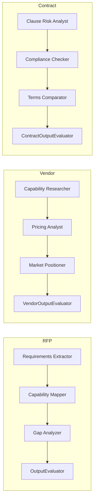

# Architecture

System design, component inventory, and data-flow notes for the agent-orchestrator monorepo at commit `094b419`.

Related: [GOVERNANCE.md](GOVERNANCE.md) · [SECURITY.md](SECURITY.md) · [CASE_STUDY.md](CASE_STUDY.md) · [AWS_SERVICE_MAPPING.md](AWS_SERVICE_MAPPING.md)

---

## Overview

Agent Orchestrator is a Python monorepo that runs **multi-agent AI pipelines for enterprise document analysis**. It demonstrates enterprise-grade agent orchestration with a shared governance stack: provider abstraction, input/output guardrails, LLM-as-a-judge evaluation, human-in-the-loop (HITL) review, immutable audit logging, and sensitivity-aware structured logging. Three domain packages reuse that core without importing each other: an **RFP Response Analyzer**, a **Vendor Evaluation Pipeline**, and a **Contract Risk Reviewer**.

---

## Technology Stack

| Layer | Technology |
|---|---|
| Language | Python 3.11 |
| Infrastructure | Docker Compose (Postgres 16 + pgvector, Redis 7) |
| LLM Access | Amazon Bedrock via boto3 (`BedrockProvider`), local provider via httpx (`LocalProvider`) |
| Default Bedrock model | Configurable; default `anthropic.claude-sonnet-4-6-20250514` (`BEDROCK_MODEL_ID`) |
| Embeddings | Amazon Bedrock Titan Embeddings (`BedrockEmbeddingProvider`), local embeddings (`nomic-embed-text`) |
| AWS Services | Textract (document processing), Comprehend (entity/PII detection) via service adapters |
| Logging | structlog (JSON, sensitivity-based separation) |
| Testing | pytest (**172** tests) |

---

## Monorepo Structure

```
agent-orchestrator/
├── README.md
├── packages/
│   ├── core/
│   │   ├── audit/              # Immutable audit trail (Postgres + triggers)
│   │   ├── cloud/              # ModelProvider ABC, BedrockProvider, LocalProvider
│   │   ├── database/           # DatabasePool (default port 5433), migrations
│   │   ├── evaluation/         # BaseOutputEvaluator ABC (LLM-as-a-judge)
│   │   ├── guardrails/         # GuardrailsEngine (input/output safety checks)
│   │   ├── hitl/               # HITLManager (human-in-the-loop governance gate)
│   │   ├── logging/            # Structured logging, sensitivity separation
│   │   ├── metrics/            # MetricsTracker (token usage, business metrics)
│   │   ├── orchestrator/       # OrchestratorEngine, DAGExecutor (see note below)
│   │   ├── prompts/            # PromptRegistry, PromptVersion (versioned templates)
│   │   ├── rag/                # DocumentChunker, VectorStore, RAGRetriever
│   │   ├── security/           # HITLAccessControl (RBAC), SecretsProvider
│   │   ├── services/           # DocumentProcessor, TextAnalyzer (Textract/Comprehend)
│   │   ├── types/              # AgentResponse, TokenUsage, shared schemas
│   │   └── utils.py            # extract_json_object, clamp_confidence
│   ├── domain-rfp/             # RFP Response Analyzer (3 agents + evaluator)
│   ├── domain-vendor/          # Vendor Evaluation Pipeline (3 agents + evaluator)
│   └── domain-contract/        # Contract Risk Reviewer (3 agents + evaluator)
├── infra/
│   ├── docker-compose.yml
│   └── init-db/                # SQL init scripts (schema, triggers)
└── docs/
    ├── ARCHITECTURE.md
    ├── GOVERNANCE.md
    ├── SECURITY.md
    ├── CASE_STUDY.md
    └── AWS_SERVICE_MAPPING.md
```

Import path note: packages install as `packages.core`, `packages.domain_rfp`, `packages.domain_vendor`, and `packages.domain_contract` (hyphenated directory names map to underscored Python packages).

---

## Core / Domain Boundary

Dependency rules enforced by layout and convention:

1. **`packages/core/` has zero domain imports.** Core modules never reference RFP, vendor, or contract packages.
2. **Domains import only from `packages.core`.** Shared utilities, providers, guardrails, HITL, audit, RAG, and evaluation live in core.
3. **Domain packages never import from each other.** RFP, vendor, and contract are siblings.

This boundary keeps governance infrastructure reusable: a fourth domain can add agents, an evaluator subclass, prompts, and a pipeline without changing existing domains or core contracts beyond optional registration of new capabilities.

```
┌─────────────────────────────────────────────────────────┐
│                     packages/core/                      │
│  providers · guardrails · evaluation · hitl · audit ·   │
│  rag · security · logging · metrics · prompts · …       │
└──────────────────────────▲──────────────────────────────┘
                           │ imports only upward
        ┌──────────────────┼──────────────────┐
        │                  │                  │
┌───────┴───────┐  ┌───────┴───────┐  ┌───────┴───────┐
│  domain-rfp   │  │ domain-vendor │  │domain-contract│
│  (no sibling  │  │ (no sibling   │  │ (no sibling   │
│   imports)    │  │  imports)     │  │  imports)    │
└───────────────┘  └───────────────┘  └───────────────┘
```

---

## Provider Abstraction Layer

Three ABCs enable swap-at-deployment without changing agent code:

| Interface | Dev / local impl | Production-oriented impl |
|---|---|---|
| `ModelProvider` | `LocalProvider` (httpx → Ollama-compatible endpoint) | `BedrockProvider` (boto3 → Bedrock) |
| `EmbeddingProvider` | `LocalEmbeddingProvider` | `BedrockEmbeddingProvider` |
| `SecretsProvider` | `EnvironmentSecretsProvider` (`os.environ`) | AWS Secrets Manager + KMS (documented in comments; **not implemented**) |

Agents and evaluators call `await self._provider.invoke(...)` (or the embedding equivalent) without knowing which backend is active. Constructor injection and config (`cloud/config.py`, env vars) select the deployment target; switching backends is a configuration and wiring choice, not a rewrite of specialist agents.

`SecretsProvider` is interface-only for production: `EnvironmentSecretsProvider` is the live implementation. No AWS SDK calls exist in `packages/core/security/secrets.py` beyond illustrative comments.

---

## Agent Pipeline Architecture

### Runtime model (critical)

Pipelines execute agents in **hardcoded sequential order**. Each specialist returns structured output that the next agent (or the evaluator) consumes.

- `OrchestratorEngine` and `DAGExecutor` exist under `packages/core/orchestrator/` but are **not the runtime** for any domain pipeline.
- The RFP pipeline optionally accepts an `OrchestratorEngine` and may **register agent capabilities** via `register_rfp_agents()`, but `analyze()` still calls extract → map → gap → evaluate as direct async method calls.
- Vendor and Contract pipelines have **zero** references to `OrchestratorEngine` or `DAGExecutor`.



### Pipeline sequences

**RFP Pipeline** (`packages/domain-rfp/pipeline.py` — `RfpAnalysisPipeline.analyze`):

`Requirements Extractor` → `Capability Mapper` → `Gap Analyzer` → `OutputEvaluator`

**Vendor Pipeline** (`packages/domain-vendor/pipeline.py` — `VendorEvaluationPipeline.evaluate`):

`Capability Researcher` → `Pricing Analyst` → `Market Positioner` → `VendorOutputEvaluator`

**Contract Pipeline** (`packages/domain-contract/pipeline.py` — `ContractReviewPipeline.review`):

`Clause Risk Analyst` → `Compliance Checker` → `Terms Comparator` → `ContractOutputEvaluator`

Pipelines call `evaluate_outputs()` on domain evaluators (thin wrappers over `BaseOutputEvaluator.evaluate`). Guardrails, when injected, run inside the pipeline file (`check_input` / `check_output`), not inside agent classes.

### Domain dependency differences (audit-verified)

| Concern | RFP | Vendor | Contract |
|---|---|---|---|
| `DocumentProcessor` / `TextAnalyzer` | Yes (Textract / Comprehend adapters) | No | No |
| `RAGRetriever` | No | Optional (capability researcher) | Optional (terms comparator) |
| `PromptRegistry` | No | Optional at construction | Optional at construction |
| Outer try/except → `FAILED` | No | No | Yes (`review` wraps `_run_review`) |
| Optional `OrchestratorEngine` registration | Yes | No | No |

---

## Evaluator Architecture

Shared LLM-as-a-judge skeleton: `BaseOutputEvaluator` in `packages/core/evaluation/base_evaluator.py`.

- All three domain evaluators inherit from it.
- Subclasses **must** implement `_build_messages(**kwargs)`.
- Subclasses **may** override `_post_parse(result, confidence)`; default is identity.
- Contract overrides `_post_parse` to clamp per-criterion scores; RFP and Vendor use the default hook.
- Each domain keeps `evaluate_outputs(...)` as a thin wrapper that forwards to `evaluate(...)` for pipeline signature compatibility.

**Invoke pattern:** the base class joins message contents into one string and calls:

```python
await self._provider.invoke(prompt=prompt, temperature=0.2, max_tokens=4096, ...)
```

It does **not** call `invoke(messages=...)`. Temperature defaults to `0.2`, `max_tokens` to `4096`, and parse-failure confidence falls back to `0.3`. Parsing uses `extract_json_object` and `clamp_confidence` from `packages.core.utils`.

| Subclass | `AGENT_NAME` | Domain criteria | Overrides |
|---|---|---|---|
| `OutputEvaluator` | `evaluator` | completeness, consistency, contradiction, reasoning_quality | `_build_messages`, `evaluate_outputs` |
| `VendorOutputEvaluator` | `vendor_evaluator` | completeness, consistency, contradiction, evidence_quality | `_build_messages`, `evaluate_outputs` |
| `ContractOutputEvaluator` | `contract_evaluator` | completeness, consistency, risk_identification_quality, reasoning_depth, source_citation_accuracy | `_build_messages`, `_post_parse`, `evaluate_outputs` |

---

## RAG Pipeline

Vector retrieval path used by vendor and contract specialists when a retriever is injected:

1. **`DocumentChunker`** — splits source documents into chunks (`packages/core/rag/chunker.py`)
2. **`EmbeddingProvider`** — embeds chunk text (`BedrockEmbeddingProvider` or `LocalEmbeddingProvider`)
3. **`VectorStore`** — persists embeddings in Postgres/pgvector (`packages/core/rag/vector_store.py`)
4. **`RAGRetriever`** — similarity search for agent grounding (`packages/core/rag/retriever.py`)

### Dimension mismatch (tracked)

| Source | Dimensions |
|---|---|
| DB schema / `VectorStore` DDL | `vector(1024)` |
| Config default (`embedding_dimensions`) | `1024` |
| Local model `nomic-embed-text` | **384** |
| Local provider fallback when model unknown | **384** |

Bedrock Titan Embed Text v2 is configured for 1024-dimensional production use. Local development with `nomic-embed-text` can diverge from the schema until dimensions are aligned. This mismatch is known architectural debt.

---

## AWS Service Equivalents

Thirteen core components (plus refinements for pipeline orchestration and local containers) are mapped to managed AWS equivalents with explicit gap analysis in [AWS_SERVICE_MAPPING.md](AWS_SERVICE_MAPPING.md). Highlights: Bedrock for model inference, Bedrock Guardrails for managed content policy, A2I + IAM for HITL/RBAC, CloudTrail / Object Lock for audit immutability, Secrets Manager + KMS for production secrets, Step Functions for workflow orchestration, and ECS/EKS for container deployment beyond Docker Compose.

---

## Known Architectural Debt

| Item | Status |
|---|---|
| `OrchestratorEngine` / `DAGExecutor` unused by pipeline runtimes | By design for Batch 8 sequential simplicity; RFP may still register capabilities |
| `AgentMessage` (`types/schemas.py`) and `DecompositionResult` (`orchestrator/models.py`) defined but unused | Cleanup scheduled for Batch 10 (P5) |
| Redis in Docker Compose | Defined and published on port 6379; **zero** Python consumers under `packages/` |
| Vector dimension mismatch | Schema/config 1024 vs local embeddings 384 |
| Compose Postgres host default | `docker-compose.yml` defaults host publish to **5432** if `POSTGRES_PORT` unset; app `DatabasePool` defaults to **5433** — copy `.env.example` so ports agree |

---

## Data Flow (end-to-end)

```
Input document / text
        │
        ▼
[optional] GuardrailsEngine.check_input  ──BLOCK──► FAILED
        │ PASS / FLAG
        ▼
Specialist agent 1 ──► Specialist agent 2 ──► Specialist agent 3
        │                      │                      │
        └────────── structured outputs ───────────────┘
                              │
                              ▼
                   Domain evaluate_outputs()
                   (BaseOutputEvaluator → invoke(prompt=...))
                              │
                              ▼
[optional] GuardrailsEngine.check_output  ──FLAG/BLOCK forces HITL
                              │
                              ▼
         confidence < threshold OR FLAG?
                    │ yes              │ no
                    ▼                  ▼
            HITLManager.save_job   COMPLETED
            PENDING_REVIEW         + audit INVOKE/EVALUATION
                    │
                    ▼
            Audit trail (immutable)
```

For governance controls in depth, see [GOVERNANCE.md](GOVERNANCE.md). For threat model and immutability triggers, see [SECURITY.md](SECURITY.md).
